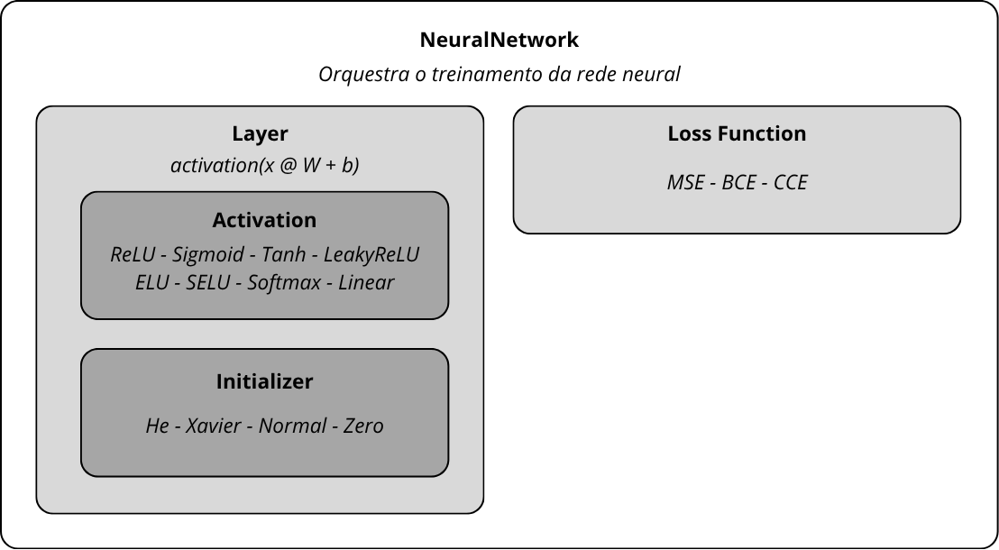

# INE5664 - Projeto Final

Implementação de uma biblioteca de redes neurais do zero com auxílio de NumPy, sem dependências de *frameworks* de *machine learning*.

Suporta classificação binária, classificação multiclasse e regressão, com *wrappers* compatíveis com a API do scikit-learn.

## Instruções de Instalação

#### Pré-requisitos

* Python 3.12+
* pip

#### Instalação das Dependências

```bash
pip install -r requirements.txt
```

### Import da Biblioteca

O pacote está localizado no diretório `src`. Para importar os módulos corretamente, a **raiz do projeto** deve estar presente no `sys.path`.

Se o código estiver sendo executado a partir da raiz do projeto, basta adicionar:

```python
import sys
sys.path.insert(0, ".")

from src.neural_network import NeuralNetwork
from src.layer import Layer
```

---

## Instruções e Exemplos de Uso

### Classificação Binária

```python
from src.neural_network import NeuralNetwork
from src.layer import Layer
 
# Montar a rede
model = NeuralNetwork(cost_function="binary_crossentropy", learning_rate=0.01)
model.add_layer(Layer(input_size=8, output_size=16, activation="relu"))
model.add_layer(Layer(input_size=16, output_size=1, activation="sigmoid"))
 
# Treinar
model.fit(X_train, y_train, epochs=200, batch_size=32, validation_split=0.2)
 
# Prever
predictions = model.predict(X_test)
```

### Classificação Multiclasse

```python
model = NeuralNetwork(cost_function="categorical_crossentropy", learning_rate=0.005)
model.add_layer(Layer(input_size=10, output_size=64, activation="relu"))
model.add_layer(Layer(input_size=64, output_size=32, activation="relu"))
model.add_layer(Layer(input_size=32, output_size=3, activation="softmax"))
# Nota: softmax + categorical_crossentropy são obrigatoriamente usados juntos.
 
model.fit(X_train, y_train_onehot, epochs=300, batch_size=64)
predictions = model.predict(X_test)
```

### Regressão

```python
model = NeuralNetwork(cost_function="mse", learning_rate=0.001)
model.add_layer(Layer(input_size=12, output_size=32, activation="tanh"))
model.add_layer(Layer(input_size=32, output_size=1, activation="linear"))
 
model.fit(X_train, y_train, epochs=500, batch_size=32)
predictions = model.predict(X_test)
```

### Early Stopping e Histórico

```python
model.fit(
    X_train, y_train,
    epochs=1000,
    batch_size=32,
    validation_split=0.2,
    patience=20,       # Interrompe após 20 épocas sem melhora
    min_delta=1e-4,    # Melhora mínima para ser considerada progresso
)
 
# Acessar histórico de perdas
print(model.history.epochs)
print(model.history.losses)
print(model.history.eval_losses)  # Disponível se validation_data foi fornecido
```

---

## Arquitetura da API



### Funções de Ativação (`activations.py`)

| Nome             | Classe        | Inicializador padrão |
| ---------------- | ------------- | --------------------- |
| `"relu"`       | `ReLU`      | He                    |
| `"leaky_relu"` | `LeakyReLU` | He                    |
| `"elu"`        | `ELU`       | He                    |
| `"selu"`       | `SELU`      | He                    |
| `"sigmoid"`    | `Sigmoid`   | Xavier                |
| `"tanh"`       | `Tanh`      | Xavier                |
| `"softmax"`    | `Softmax`   | Xavier                |
| `"linear"`     | `Linear`    | Xavier                |

### Funções de Custo (`cost_functions.py`)

| Nome                           | Classe                      | Restrição                        |
| ------------------------------ | --------------------------- | ---------------------------------- |
| `"mse"`                      | `MeanSquaredError`        | -                                  |
| `"binary_crossentropy"`      | `BinaryCrossEntropy`      | Saída com`sigmoid`              |
| `"categorical_crossentropy"` | `CategoricalCrossEntropy` | Saída com`softmax` obrigatório |

### Inicializadores (`initializers.py`)

| Nome                | Classe                      | Indicado para                  |
| ------------------- | --------------------------- | ------------------------------ |
| `"xavier"`        | `XavierInitializer`       | Sigmoid, Tanh, Softmax, Linear |
| `"he"`            | `HeInitializer`           | ReLU, LeakyReLU, ELU, SELU     |
| `"random_normal"` | `RandomNormalInitializer` | Uso geral                      |
| `"zero"`          | `ZeroInitializer`         | Vieses (padrão interno)       |

---

## Estrutura do Projeto

```
ine5664-projeto-final
├── datasets/                           # Conjuntos de dados para treinamento.
│   ├── star_classification.csv         # - Classificação Multiclasse
│   ├── student_habits_performance.csv  # - Regressão
│   └── Titanic-Dataset.csv             # - Classificação Binária
├── images/                             # Diagramas e imagens relacionados.
│   ├── achitecture.png
├── notebooks/                          # Jupyter Notebooks utilizados em demonstrações práticas.
│   ├── binary_classification.ipynb
│   ├── multiclass_classification.ipynb
│   └── regression.ipynb
├── README.md
├── requirements.txt
├── src/                                # Código-fonte da biblioteca.
│   ├── activations.py
│   ├── cost_functions.py
│   ├── initializers.py
│   ├── __init__.py
│   ├── layer.py
│   └── neural_network.py
└── wrappers/                           # Adaptadores da biblioteca compatíveis com a API do sklearn.
    ├── classifier.py
    ├── __init__.py
    ├── multiclass.py
    └── regressor.py
```

---

## Limitações

* **Otimizador único:** Apenas o gradiente descendente com taxa de aprendizado fixa foi implementado. Outros otimizadores que poderiam ser implementados seriam: Adam, RMSProp, momentum, etc.
* **Regularização:** Não há implementação de dropout e L1/L2.
* **Softmax restrita à saída:** A implementação do gradiente combinado CCE + Softmax exige que Softmax seja usada exclusivamente como ativação da última camada. Usá-la em camadas intermediárias produzirá gradientes incorretos.
* **CPU apenas:** Todos os cálculos usam NumPy e são executados na CPU. Não há suporte a GPU ou processamento paralelo.

---

## Participantes

| Nome                    | Matrícula | Usuário do GitHub |
| ----------------------- | ---------- | ------------------ |
| Ana Regina Delazzari    | 22102191   | anaard             |
| Fabricio Duarte Júnior | 22100615   | winterhazel        |
